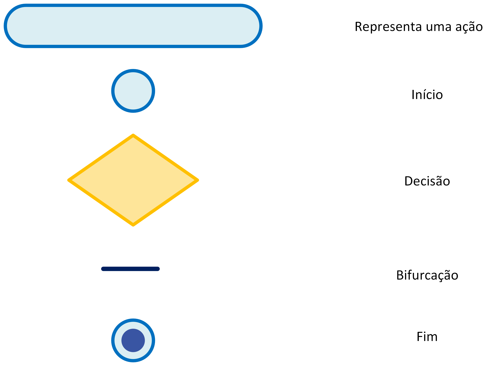
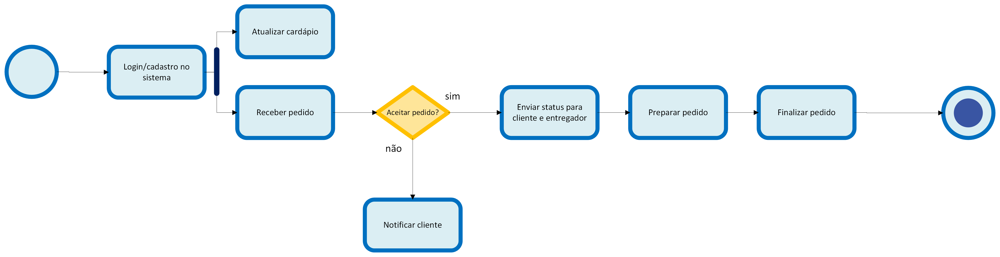
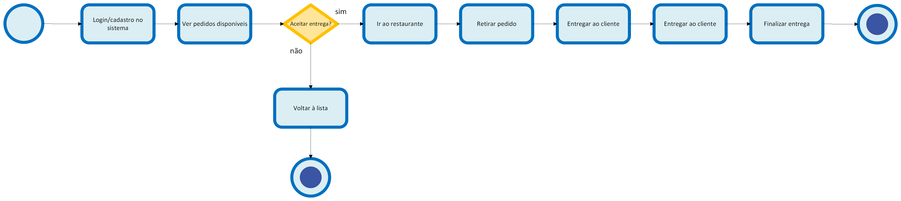
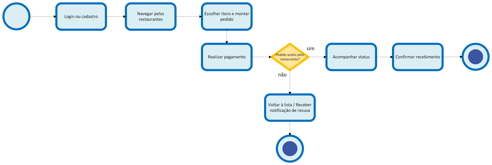

# Diagrama de Atividades

## Introdução

O Diagrama de Atividades é uma das ferramentas da UML (Unified Modeling Language) utilizada para modelar os aspectos dinâmicos de um sistema. Ele foca no fluxo de controle de uma atividade para outra, mostrando a sequência de ações e as condições que governam esse fluxo. É especialmente útil para descrever o fluxo de trabalho (workflow) de um caso de uso, de um processo de negócio ou de uma operação complexa.

De acordo com a Lucidchart, 
> "Um diagrama de atividade é um tipo de diagrama de comportamento da UML (Linguagem de Modelagem Unificada) que funciona essencialmente como um fluxograma, mostrando as atividades executadas por um sistema. Ele é usado para descrever o que precisa acontecer no sistema que está sendo modelado, ajudando a alinhar as áreas de negócios e de desenvolvimento." ¹

Segundo Fowler,
> "Os diagramas de atividade são uma das partes mais inesperadas da UML. Ao contrário da maioria das outras técnicas na UML, o diagrama de atividade não tem origens claras nos trabalhos anteriores dos 'três amigos'. Em vez disso, o diagrama de atividade combina ideias de várias técnicas: os diagramas de eventos de Jim Odell, técnicas de modelagem de estados SDL, modelagem de fluxo de trabalho e redes de Petri." ²

### Relação com o BPMN

É importante notar a relação entre o Diagrama de Atividades da UML e o BPMN (Business Process Model and Notation). Ambos são utilizados para modelar fluxos de trabalho de forma visual, quase como um fluxograma. No entanto, seus propósitos e públicos são distintos.

*   **BPMN:** É uma notação criada especificamente para a modelagem de processos de negócio. Seu objetivo é ser facilmente compreendida por todas as partes interessadas, desde analistas de negócio e gestores até desenvolvedores. A notação do BPMN é mais rica e expressiva para cenários de negócio, incluindo uma vasta gama de tipos de eventos (temporizadores, mensagens, erros) e tarefas.

*   **Diagrama de Atividades (UML):** Faz parte de uma linguagem mais ampla (UML) e é primariamente utilizado na engenharia de software para modelar o comportamento dinâmico de um sistema. É mais focado no público técnico (desenvolvedores, arquitetos de software) para detalhar a lógica de um método, os passos de um caso de uso ou o comportamento de um componente de software.

Em muitos projetos, as duas notações são usadas em conjunto. Um analista de negócios pode modelar um processo de alto nível usando BPMN, e a equipe de desenvolvimento pode então usar Diagramas de Atividade para detalhar os aspectos técnicos da implementação do software que suportará aquele processo. No contexto deste projeto, o Diagrama de Atividades foi escolhido por seu foco no detalhamento do fluxo de controle dentro do sistema de software que está sendo desenvolvido, complementando a modelagem de processos de negócio realizada na primeira entrega do projeto.³

## Diagrama
### Legenda

Figura 1: Diagrama de Atividade Legenda dos ícones utilizados.

Fonte: Ana Joyce e Gabriela (2025)

### Fluxo executado pelo o fornecedor

Figura 2: Diagrama de Atividades: Fornecedores.

Fonte: Ana Joyce e Gabriela (2025)

### Fluxo executado pelo o entregador

Figura 3: Diagrama de Atividades: Entregadores.

Fonte: Ana Joyce e Gabriela (2025)

### Fluxo executado pelo o cliente

Figura 4: Diagrama de Atividades: Cliente.

Fonte: Ana Joyce e Gabriela (2025)

## Aplicação no projeto

Como afirma Fowler,
> "Esses diagramas são particularmente úteis em conexão com o fluxo de trabalho e na descrição de comportamento que possui muito processamento paralelo." ²

Os diagramas de atividades foram fundamentais para a modelagem dos processos de negócio do nosso projeto, o "PodePedirFCTE". Eles nos permitiram visualizar e detalhar o fluxo de trabalho para cada um dos três principais atores do sistema: o **Cliente**, o **Fornecedor** (restaurante/lanchonete) e o **Entregador**.

Para a elaboração destes diagramas, a equipe utilizou a ferramenta Microsoft Visio, que permitiu a criação de representações visuais claras e detalhadas dos fluxos de trabalho.

Ao mapear as ações de cada ator, desde o cadastro até a finalização de um pedido, conseguimos uma compreensão clara das interações e dependências entre eles. Por exemplo, o fluxo do cliente de "Realizar Pedido" dispara o fluxo do fornecedor de "Receber Pedido", que por sua vez, após o preparo, aciona o fluxo do entregador com a "Notificação de Entrega".

Essa modelagem nos ajudou a:
- **Identificar Requisitos Funcionais:** Cada ação no diagrama representa um requisito funcional que o sistema deve suportar, como `Atualizar cardápio`, `Acompanhar entrega` e `Aceitar entrega`.
- **Definir a Experiência do Usuário:** Ao entender a sequência de passos de cada ator, podemos projetar interfaces mais intuitivas e que atendam às suas necessidades em cada etapa do processo.
- **Prever Pontos de Falha:** As estruturas de decisão (como "Pedido aceito?" ou "Aceitar entrega?") são pontos críticos. Modelá-las nos permite planejar como o sistema deve se comportar em cenários de sucesso e de falha, garantindo uma maior robustez.

A separação dos fluxos por ator também foi uma decisão de projeto importante, pois simplificou a análise e facilitará o desenvolvimento modular do sistema, onde cada módulo pode ser focado em atender às necessidades de um perfil de usuário específico.

### Dificuldades Encontradas pela equipe

Uma das principais discussões durante a criação dos diagramas foi definir o nível de detalhe adequado. Inicialmente, pensamos em criar um único diagrama abrangendo todos os atores, mas percebemos que ele se tornaria complexo e difícil de entender. A decisão de dividir o fluxo em três diagramas distintos, um para cada ator, foi crucial para manter a clareza e a legibilidade. Outro ponto de debate foi como representar a comunicação entre os diferentes atores, que embora separados em diagramas, interagem constantemente. Optamos por focar no fluxo de atividades de cada um, deixando os detalhes da comunicação para serem modelados em um Diagrama de Sequência.

## Quadro de Participações

| **Membro da equipe** | **Função** |
| :------------- | :--------- |
| [Gabriela](https://github.com/gaubiela) | Elaboração do Diagrama e Revisão da Documentação |
| [Ana Joyce](https://github.com/anajoyceamorim) | Elaboração do Diagrama e Documentação do Diagrama |

## Referências

> ² FOWLER, Martin. UML Distilled: A Brief Guide to the Standard Object Modeling Language. 3. ed. Boston: Addison-Wesley, 2004.
> SERRANO, Milene. VideoAula - DSW-Modelagem - Atividades. Disponível em: https://unbbr-my.sharepoint.com/personal/mileneserrano_unb_br/_layouts/15/stream.aspx?id=%2Fpersonal%2Fmileneserrano%5Funb%5Fbr%2FDocuments%2FArqDSW%20%2D%20V%C3%ADdeosOriginais%2F06c%20%2D%20VideoAula%20%2D%20DSW%2DModelagem%20%2D%20Atividades%2Emp4&ga=1. Acesso em: 21 de set. de 2025.
> ¹ O que é um diagrama de atividades UML? Lucidchart. Disponível em: https://www.lucidchart.com/pages/pt/o-que-e-diagrama-de-atividades-uml. Acesso em: 22 de set. de 2025.
> ³ T01-G7_PodePedirFCTE. Modelagem BPMN - Entrega 01. Disponível em: https://unbarqdsw2025-2-turma01.github.io/2025.2-T01-G7_PodePedirFCTE_Entrega_01/#/Base/bpmn/1.3.ModelagemBPMN. Acesso em: 22 de set. de 2025.

## Histórico de Versões

| **Data**       | **Versão** | **Descrição**                         | **Autor**                                      | **Revisor**                                      | **Data da Revisão** |
| :--------: | :----: | :-------------------------------- | :----------------------------------------: | :----------------------------------------: | :-------------: |
| 21/09/2025 |  `1.0`   | Criação do documento e adição dos diagramas. | [`@Ana Joyce`](https://github.com/anajoyceamorim) | [`@Gabriela`](https://github.com/gaubiela) |   21/09/2025    |
| 22/09/2025 |  `1.0`   | Adição de novos dados ao documento. | [`@Ana Joyce`](https://github.com/anajoyceamorim) | [`@Ana Clara`](https://github.com/anabborges) |   22/09/2025    |