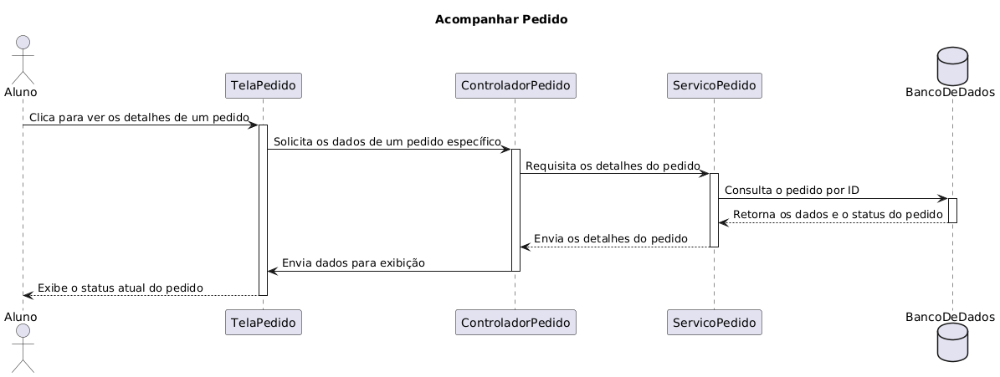
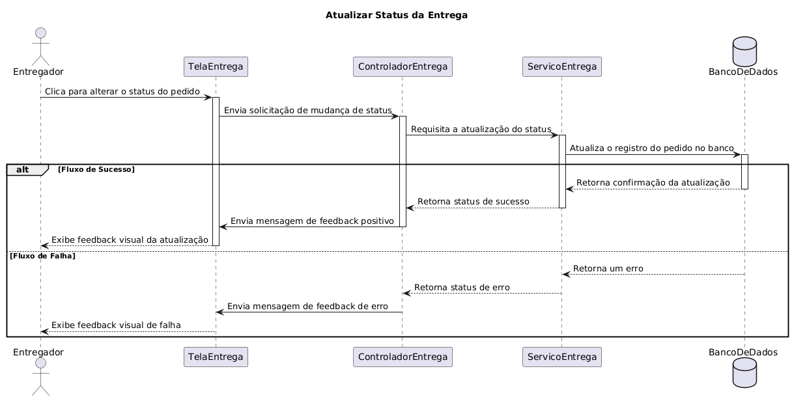
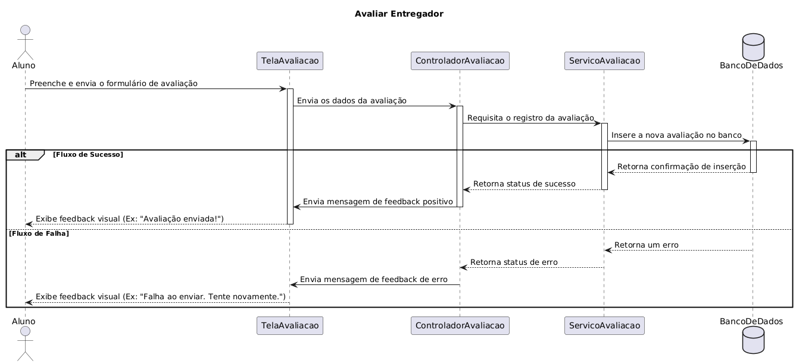
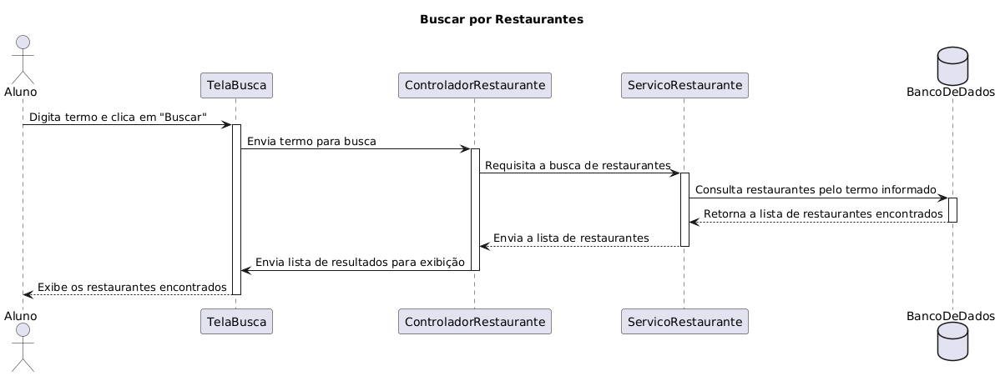
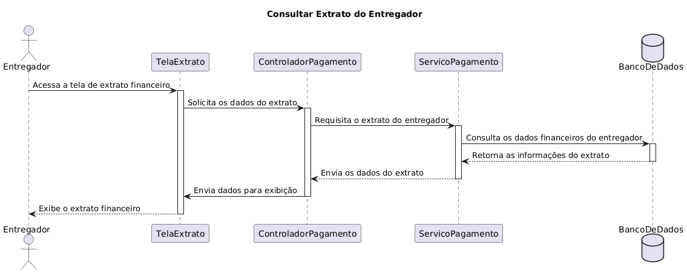
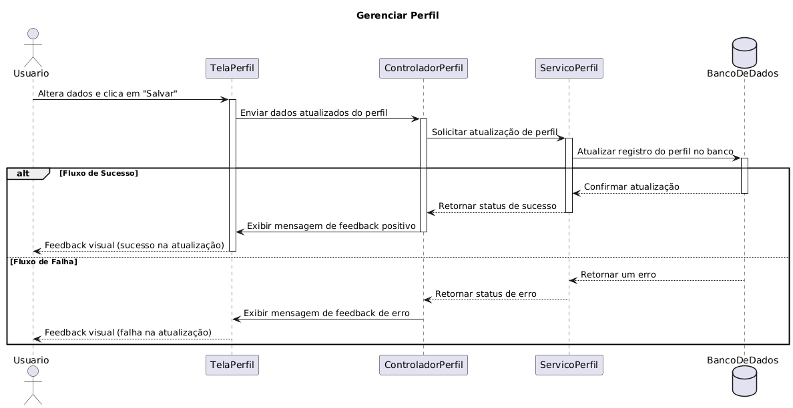
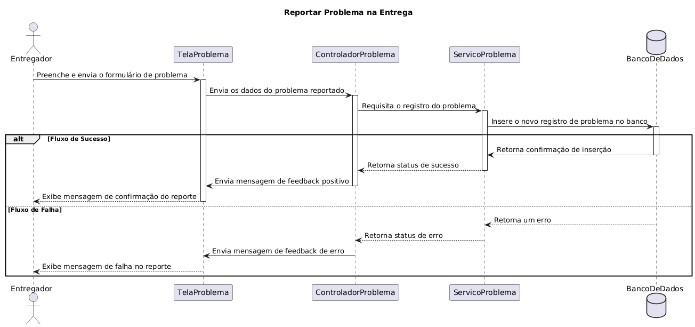
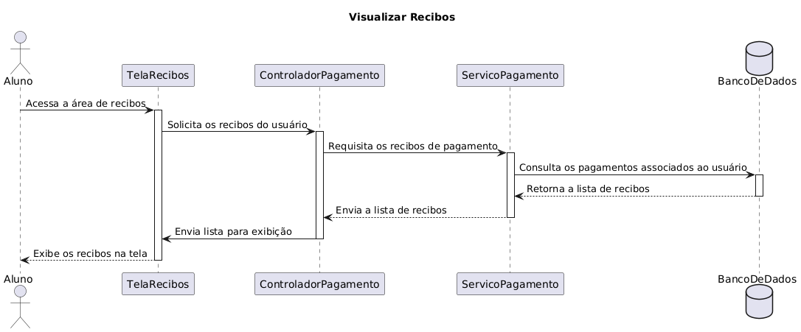

# DIAGRAMA DE SEQUÊNCIA

## Introdução

O diagrama de sequência é um tipo de diagrama da UML (Unified Modeling Language) utilizado para representar a interação entre objetos em um determinado cenário de uso do sistema. Ele mostra a ordem em que as mensagens são trocadas e como os objetos colaboram para realizar uma funcionalidade específica.

Esse diagrama é muito útil para compreender o **fluxo de execução**, evidenciando a sequência temporal das interações.

## Diagramas

### Acompanhar Pedido

### Atualizar Status da Entrega

### Avaliar Entregador

### Buscar Restaurantes

### Consultar Extrato

### Gerenciar Perfil

### Histórico de Entregas

### Histórico de Pedidos

### Reportar Problema Entrega

### Visualizar Recibos

### Vantagens

- Facilita a compreensão do **fluxo de interação** entre componentes.
- Evidencia a ordem temporal das mensagens.
- Auxilia no refinamento dos requisitos e na identificação de responsabilidades.

### Desvantagens

- Pode se tornar **complexo e pouco legível** em cenários com muitas interações.
- Exige atualização constante para se manter alinhado com o sistema real.

## Aplicação no projeto

COMPLEMENTAR

## Referências

- Visual Paradigm. What is Sequence Diagram? Disponível em: https://www.visual-paradigm.com/guide/uml-unified-modeling-language/what-is-sequence-diagram.

## Histórico de Versões

|  **Data**  | **Versão** | **Descrição**                                                  |                   **Autor**                    |        **Revisor**         | **Data da Revisão** |
| :--------: | :--------: | :------------------------------------------------------------- | :--------------------------------------------: | :------------------------: | :-----------------: |
| 21/09/2025 |    1.0     | Criação da sessão                                              | [Guilherme Storch](https://github.com/storch7) | [`@`](https://github.com/) |     00/00/0000      |
| 21/09/2025 |    1.1     | Criação dos diagramas de sequência referentes aos casos de uso | [Nathan Batista](https://github.com/Nathan-bs) | [`@`](https://github.com/) |     00/00/0000      |
