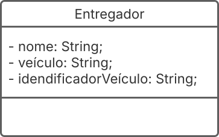
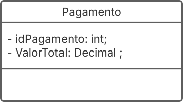
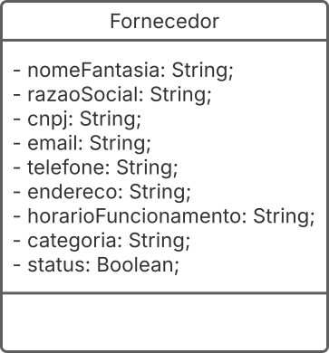
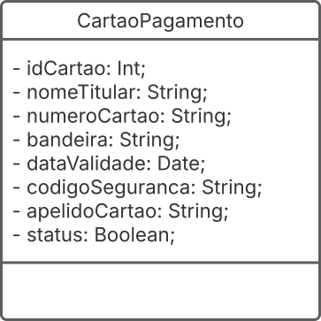
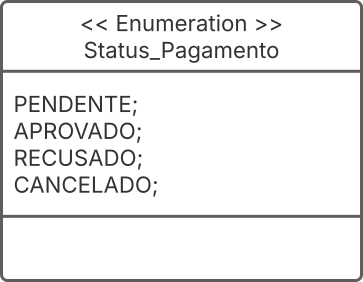
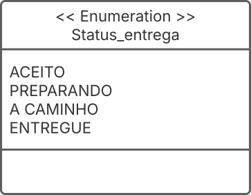
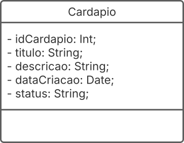
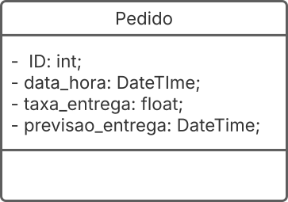

# Diagrama de Classes

## Introdução

O Diagrama de classes é usado para descrever a estrutura estática de classes no sistema, permitindo definir os atributos, operações (métodos) e os relacionamentos entre as classes (LUCIDCHART, 2025).

## Diagrama de Classes

O Diagrama de Classes é um dos tipos mais importantes e populares da Linguagem de Modelagem Unificada (UML). Ele é um diagrama de estrutura, ou seja, o seu principal objetivo é descrever a estrutura estática de um sistema, mostrando os elementos que devem estar presentes e como eles se relacionam entre si.

O diagrama funciona como uma "cópia" do sistema ou de seus componentes. Ele é fundamental na programação orientada a objetos, porque modela as classes que formarão o software a ser desenvolvido, os seus objetos principais e as interações entre eles (LUCIDCHART, 2025).

### Vantagens
O uso de diagramas de classes traz vantagens importantes para uma organização, pois eles permitem:
- Modelar e Compreender Dados
- Melhorar a Comunicação
- Orientar o Desenvolvimento do projeto
- Criar uma Visão Abstrata (IBM, 2025).

## Aplicação no projeto PodePedirFCTE

No que se refere ao processo de análise de informações para confecção do artefato, foram levados em consideração os seguintes pontos da primeira entrega:

- [Design Sprint](https://unbarqdsw2025-2-turma01.github.io/2025.2-T01-G7_PodePedirFCTE_Entrega_01/#/./Base/design-sprint/1.1.DesignSprint), com foco na etapa de [prototype](https://unbarqdsw2025-2-turma01.github.io/2025.2-T01-G7_PodePedirFCTE_Entrega_01/#/./Base/design-sprint/1.1.5.Prototype):  Expressa a relação dos participantes na dinâmica da aplicação, bem como suas interações com as interfaces prototipadas e seus objetivos finais ao utilizar a plataforma. O diagrama de classes foi obtido por meio da abstração dos atores e funcionalidades ao longo do fluxo principal de atividades da plataforma, sendo aqui expresso nas classes modeladas.

O diagrama abaixo mostra a estrutura geral do sistema, evidenciando as relações e responsabilidades de cada componente.

  

### Classes

Após observar a visão geral, é importante detalhar cada classe individualmente. 

#### Usuário

- A classe Usuário é pai das classes Aluno, Entregador, Fornecedor;  
- A classe possui os atributos necessários entre todos as classes-filho para que um usuário tenha uma conta no sistema.  

#### Aluno

- A classe Aluno é herdeira da classe Usuário;  
- Ela possui atributos necessários para criar uma conta especificamente de Aluno.  

#### Entregador

- A classe Entregador é herdeira da classe Usuário;  
- Ela possui atributos necessários para criar uma conta especificamente de Entregador.  

#### Pagamento

- Classe que gerencia o processo de pagamento entre fornecedores e alunos;  
- A Classe Aluno se relaciona com a Classe Pagamento por Agregação;  
- A Classe Fornecedor se relaciona com a Classe Pagamento por Agregação.  

#### Fornecedor

- A classe Fornecedor é herdeira da classe Usuário;  
- Ela possui atributos necessários para criar uma conta especificamente de Fornecedor.  

#### CartaoPagamento

- Classe que se relaciona com a Classe Aluno por Agregação;  
- O objetivo é armazenar uma listagem de Cartões que um aluno venha ter.  

#### Enum_Tipo

- Enumeration que encapsula as tipologias de cartões.  

#### Enum_Status_Pagamento

- Enumeration que encapsula os status de pagamento.  

#### Enum_Status_Entrega

- A classe Enum_Status_Entrega é um enum e possui instâncias fixas;  
- A classe representa os possíveis status que uma entrega pode se encontrar.  

#### Enum_Tipo_Pagamento

- Enumeration que encapsula os tipos de pagamento.  

#### Cardapio

- A classe Cardápio representa os Cardapios que um fornecedor pode cadastrar no aplicativo;  
- Os atributos dela representam informações que o fornecedor apresentará ao sistema para instanciar um objeto.  

#### Item

- A classe Item representa cada item do cardápio dos restaurantes;  
- Os atributos dela representam informações que o fornecedor apresentará ao sistema para instanciar um objeto.  

#### Pedido

- A classe Pedido representa os pedidos que são feitos pelos compradores;  
- Ela possui atributos de interesse dos compradores.  

## Quadro de Participações

| **Membro da equipe** | **Função** |
| :------------- | :--------- |
| [Ana Clara](https://github.com/anabborges) | Autora do diagrama e detalhamento de classes na documentação |
| [Fábio](https://github.com/fabinsz) | Documentação da metodologia |
| [Guilherme Storch](https://github.com/storch7) | Autor do diagrama |

## Referências

- LUCIDCHART. *O que é um diagrama de classe UML?*. 2025. Disponível em: <https://www.lucidchart.com/pages/pt/o-que-e-diagrama-de-classe-uml>. Acesso em: 22 set. 2025.  

- IBM. *Diagrama de Classes*. 2025. Disponível em: <https://www.ibm.com/docs/pt-br/rsas/7.5.0?topic=structure-class-diagrams>. Acesso em: 22 set. 2025.  

## Histórico de Versões

| **Data**       | **Versão** | **Descrição**                         | **Autor**                                      | **Revisor**                                      | **Data da Revisão** |
| :--------: | :----: | :-------------------------------- | :----------------------------------------: | :----------------------------------------: | :-------------: |
| 21/09/2025 |  `1.0`   | Criação da página do diagrama de classes. | [`@Fabinsz`](https://github.com/fabinsz) | [`@Ana Clara`](https://github.com/anabborges) |   21/09/2025    |
| 21/09/2025 |  `1.1`   | Ajusta o documento para conformidade com o modelo. | [`@Ana Clara`](https://github.com/anabborges) | [`@Guilherme Storch`](https://github.com/storch7) |   21/09/2025    |
| 21/09/2025 |  `1.2`   | Adiciona explicação sobre o Diagrama de Classes e referências. | [`@Ana Clara`](https://github.com/anabborges) | [`@Guilherme Storch`](https://github.com/storch7) |   21/09/2025    |
| 21/09/2025 |  `1.3`   | Adiciona explicação das classes Usuário, Aluno, Entregador e Fornecedor | [`@Ana Clara`](https://github.com/anabborges) | [`@Guilherme Storch`](https://github.com/storch7) |   21/09/2025    |
| 21/09/2025 |  `1.4`   | Adiciona explicação das classes Enum_Status_Entrega, Pedido e Item | [`@Ana Clara`](https://github.com/anabborges) | [`@Guilherme Storch`](https://github.com/storch7) |   21/09/2025    |
| 21/09/2025 |  `1.5`   | Adiciona explicação de classes e revisão geral. | [`@Guilherme Storch`](https://github.com/anabborges) | [`@Guilherme Storch`](https://github.com/storch7) |   21/09/2025    |