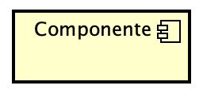
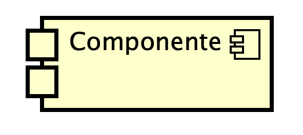
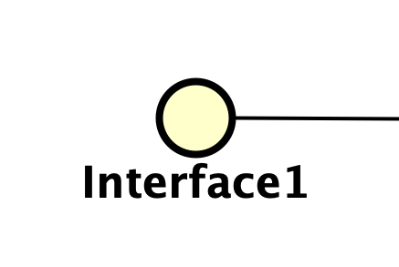
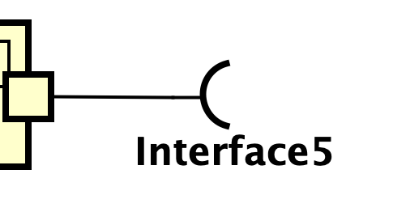

# Diagrama de Componentes

## Introdução

O principal objetivo ao produzir um diagrama de componentes para um projeto é mostrar as relações estruturais entre os componentes de um sistema. Na notação UML 2, os componentes são considerados unidades autônomas e encapsuladas dentro de um sistema ou subsistema que fornecem uma ou mais interfaces. Embora a especificação da UML 2 não especifique isso estritamente, os componentes são unidades de projeto maiores que representam elementos que normalmente serão implementados usando módulos "substituíveis". 

Os componentes são construções estritamente lógicas em tempo de projeto. A ideia é os programadores possam reutilizar e/ou substituir facilmente uma implementação de componente diferente em seus projetos, pois um componente encapsula o comportamento e implementa interfaces especificadas.

## Componentes do Diagrama

| **Nome do Componente** | **Significado** | **Representação** |
| :--------------------- | : ------------- | : --------------- |
| Componente | Um componente é representado com um representado por um retângulo com o seu nome, além disso, um ícone pode ser adicionado no topo direito do componente para omitir a palavra "componente" da representação. |  |
| Portas | Uma porta é responsável por fornecer uma maneira de modelar como as interfaces fornecidas/obrigatórias de um componente se relacionam com as suas partes internas |  |
| Interface Fornecida | Uma interface fornecida é aquela que é realizada diretamente pelo próprio componente, ou é realizada por um dos classificadoras que implementaram o componente. Ela também pode ser fornecida por uma porta pública do componente. |  |
| Interface Requerida | Uma interface requerida é designada pela dependência de uso do próprio componente, ou é designada pela dependência de uso de um dos classificadores que implementam o componente. Além disso, ela também pode ser requerida por uma porta pública do componente. |  |

## Diagrama de Componentes do PodePedirFCTE

<strong>Figura 1</strong> – Diagrama de componentes do projeto PodePedirFCTE.

### Quadro de Participações

| **Membro da Equipe**                             | **Função** |
| :--------------------------------------------| |
| [Cayo](https://github.com/Cayoalencar)              | Versão inicial do diagrama de componentes |
| [Luiz](https://github.com/luizfaria1989)            | Criação da introdução do artefato |
| [Rodrigo](https://github.com/rodrigoFAmaral)        | Subsistema Backend e relações com AppEstudante |
| [Willian](https://github.com/Wooo589)               | Relações com AppEntregador e AppRestaurante |

## Referências Bibliográficas

> FAKHROUTDINOV, Klirill. Component. **uml-diagrams.org**, 2009a. Disponível em: https://www.uml-diagrams.org/component.html. **Acesso em 20 set. 2025.**

> FAKHROUTDINOV, Klirill. Dependency in UML. **uml-diagrams.org**, 2009b. Disponível em: https://www.uml-diagrams.org/dependency.html. **Acesso em 20 set. 2025.**

> FAKHROUTDINOV, Klirill. UML Component Diagrams. **uml-diagrams.org**, 2009c. Disponível em: https://www.uml-diagrams.org/component-diagrams.html. **Acesso em 20 set. 2025.**

> IBM. The component diagram. **IBM Developer**, dez.2004. Disponivel em: https://developer.ibm.com/articles/the-component-diagram/. **Acesso em: 20 set. 2025.**

---

## Histórico de Versões

| **Data**       | **Versão** | **Descrição**                         | **Autor**                                      | **Revisor**                                      | **Data da Revisão** |
| :--------: | :----: | :-------------------------------- | :----------------------------------------: | :----------------------------------------: | :-------------: |
| 20/09/2025 |  `1.0`   | Criação da página do diagrama de componentes. | [`@Willian`](https://github.com/Wooo589) | [`@Luiz`](https://github.com/luizfaria1989) |   21/09/2025    |
| 21/09/2025 |  `1.1`   | Criação da introdução do artefato. | [`@Luiz`](https://github.com/luizfaria1989) | [`@`](https://github.com/) |   00/00/0000    |