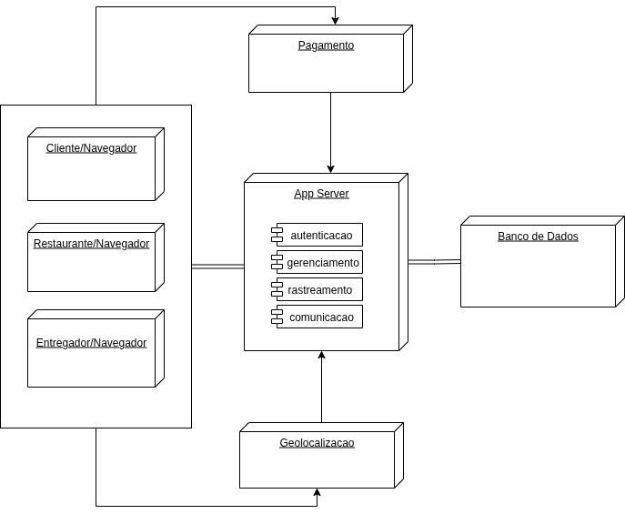

# Diagrama de Implantação

## Introdução

O Diagrama de Implantação é um diagrama estrutural da UML que modela a arquitetura física de um sistema. Ele mostra como os artefatos de software (como arquivos executáveis, bibliotecas e componentes) são distribuídos e executados nos nós de hardware (como servidores, dispositivos de cliente e outros equipamentos).

Este diagrama é essencial para visualizar, especificar e documentar a topologia de hardware e a distribuição dos componentes de software do sistema, auxiliando no planejamento da infraestrutura e na análise de desempenho e escalabilidade.

## Diagrama

Figura 1: Diagrama de Implantação do Sistema "PodePedirFCTE".

Fonte: Ana Joyce, Grabriela e João Filipe (2025)

## Aplicação no projeto

Para o projeto "PodePedirFCTE", o Diagrama de Implantação será utilizado para visualizar a topologia de hardware onde os componentes do nosso software serão executados. Ele detalhará os seguintes aspectos:

- **Nó do Cliente:** Representando os dispositivos móveis (smartphones/tablets) onde a aplicação do cliente e do entregador será instalada (artefato `.apk` ou `.ipa`).
- **Nó do Servidor de Aplicação:** Um servidor em nuvem (ex: AWS, Azure, Google Cloud) que hospedará a API backend, responsável por toda a lógica de negócio, gerenciamento de pedidos, usuários e comunicação.
- **Nó do Servidor Web:** Responsável por servir a aplicação web para os fornecedores (restaurantes) gerenciarem seus estabelecimentos e pedidos.
- **Nó do Banco de Dados:** Um servidor dedicado (ou serviço de banco de dados gerenciado) que armazenará todos os dados da aplicação, como informações de usuários, restaurantes, cardápios e pedidos.
- **Comunicação:** As conexões de rede entre esses nós, como o protocolo HTTPS para a comunicação entre os aplicativos móveis/web e a API.

Essa modelagem é crucial para o planejamento da infraestrutura, para entender os requisitos de hardware levantados, identificar gargalos de desempenho e garantir a escalabilidade e a segurança do sistema.

## Referências

> LEITE, Rodrigo M. **Curso de UML - Diagrama de Implantação**. YouTube, 27 de maio de 2020. Disponível em: <https://www.youtube.com/watch?v=DgERD0HgggQ>. Acesso em: 22 set. 2025.

## Histórico de Versões

| **Data** | **Versão** | **Descrição** | **Autor** | **Revisor** | **Data da Revisão** |
| :---: | :---: | :--- | :---: | :---: | :---: |
| 22/09/2025 | '1.0' |Revisão do documento | @Joao151104 | :--: | :---: |
| 22/09/2025 | `1.0` | Criação da versão inicial do documento | [`@anajoyceamorim`](https://github.com/anajoyceamorim) | [`@gaubiela`](https://github.com/gaubiela) | 22/09/2025 |
