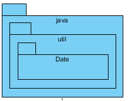
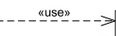

## Diagrama de Pacotes

## Introdução

Os **diagramas de pacotes** da UML são uma ferramenta fundamental na engenharia de software para organizar e visualizar a estrutura de sistemas complexos. Eles permitem que os desenvolvedores agrupem elementos relacionados, como classes ou casos de uso, em pacotes, tornando modelos grandes mais gerenciáveis e esclarecendo as dependências entre diferentes partes de um sistema.O Diagrama de Pacotes é a "planta baixa do código", mostrando como os arquivos e pastas são organizados antes mesmo de o programa ser construído.

## Aplicação ao Projeto
O diagrama de pacotes da Entrega 2 foi construído a partir dos artefatos desenvolvidos na Entrega 1, durante a aplicação da metodologia [Design Sprint](https://unbarqdsw2025-2-turma01.github.io/2025.2-T01-G7_PodePedirFCTE_Entrega_01/#/./Base/design-sprint/1.1.DesignSprint). Nesse momento, a equipe elaborou protótipos, identificou fluxos de usuário e representou os principais processos por meio de diagramas [BPMN](https://unbarqdsw2025-2-turma01.github.io/2025.2-T01-G7_PodePedirFCTE_Entrega_01/#/Base/bpmn/1.3.ModelagemBPMN).

Esses insumos permitiram mapear as funcionalidades centrais do sistema (como criação de pedidos, cadastro de restaurantes, login de usuários, entre outros), refletidas agora na arquitetura apresentada no diagrama de pacotes. As funcionalidades que orientaram a produção do artefato têm origem direta na dinâmica do Design Sprint, especialmente na etapa de idealização do [protótipo](https://unbarqdsw2025-2-turma01.github.io/2025.2-T01-G7_PodePedirFCTE_Entrega_01/#/./Base/design-sprint/1.1.5.Prototype), que explorou diferentes perspectivas de uso: restaurante, estudante e entregador. Essa visão multifacetada possibilitou estruturar melhor os pacotes, garantindo que a modelagem represente de forma clara os papéis e interações previstos para o sistema.

## Diagrama

### Componentes do Diagrama

Para ler e criar o diagrama, você precisa entender seus símbolos principais:

| **Nome do Componente** | **Significado** | **Representação** |
| :--- | :--- | :--- |
| Aninhamento (Nesting) | A hierarquia de pastas e sub-pastas. |   |
| Dependência (Dependency) | A relação `<<import>>` ou `<<use>>`. Mostra que o código na origem usa o código no destino. |   |
| Pacote (Package) | Um namespace, um módulo ou um diretório no seu código-fonte. |  |

## Aplicação no projeto

<strong>Figura 1</strong> – Diagrama de pacotes do projeto PodePedirFCTE.

### Análise Funcional da Arquitetura de Pacotes

Este diagrama de pacotes ilustra uma arquitetura de software desacoplada e modular, projetada para suportar um ecossistema de aplicações complexas. A estrutura define limites claros entre os componentes de código-fonte, garantindo manutenibilidade e escalabilidade. A seguir, detalha-se o papel e o funcionamento de cada pacote principal.

#### 1. O Pacote `SharedKernel` (Contrato de Dados Central)

O `SharedKernel` é o pilar fundamental da comunicação em toda a arquitetura. Ele funciona como uma biblioteca de baixo nível, altamente estável e com zero dependências de outros pacotes do sistema.

* **Funcionamento:** Seu propósito exclusivo é definir o "contrato de dados" que será compartilhado.
    * O sub-pacote `DTOs` (Data Transfer Objects) define a estrutura dos objetos que trafegam pela rede entre o `Backend` e os aplicativos clientes (ex: `PedidoDTO`, `UsuarioDTO`).
    * O sub-pacote `Enums` fornece um conjunto de constantes seguras (ex: `StatusPedido`), garantindo que todos os componentes interpretem os estados do sistema da mesma maneira.
* **Relações:** Ele é o único pacote que não depende de nenhum outro. Inversamente, todos os outros pacotes principais (`Backend`, `AppEstudante`, etc.) têm uma dependência direta com o `SharedKernel`, garantindo que toda a comunicação no ecossistema seja consistente e previsível.

#### 2. O Pacote `Backend` (Núcleo Orquestrador da Lógica de Negócio)

O `Backend` representa o cérebro do sistema. É um pacote de aplicação do lado do servidor que encapsula toda a lógica de negócio, regras de domínio e coordenação de processos.

* **Funcionamento:** Sua estrutura interna é modularizada por domínio de responsabilidade:
    * **`Gerenciador de Contas`:** Centraliza a identidade e o controle de acesso para todos os tipos de usuários (estudantes, comerciantes, entregadores).
    * **`Gerenciador de Restaurantes`:** Gerencia o cadastro, perfil e cardápios dos estabelecimentos.
    * **`Orquestrador de Pedidos`:** Atua como o coordenador central para o fluxo de negócio mais crítico. Ao receber uma solicitação para criar um pedido, ele interage com múltiplos outros pacotes em uma sequência lógica.
    * **Outros Gerenciadores:** Pacotes como `Pagamentos`, `Entregas`, `Avaliações` e `Notificações` são serviços especializados que executam tarefas específicas.
* **Relações:**
    * **Dependência Externa:** Assim como os outros, o `Backend` depende do `SharedKernel` para entender os DTOs recebidos dos clientes e para construir as respostas.
    * **Dependências Internas:** O `Orquestrador de pedidos` é o principal cliente dos outros gerenciadores. Um fluxo típico seria: o `Orquestrador` consulta o `Gerenciador de Contas` e o `Gerenciador de Restaurantes` para validar os dados do pedido; em seguida, aciona o `Gerencia  * **Comunicação com o `Backend`:** É crucial observar que **não há uma seta de dependência de código-fonte** para o pacote `Backend`. A comunicação é uma dependência de runtime, realizada através de chamadas de rede (API via HTTP/HTTPS) para os endpoints expostos pela camada de apresentação do dor de Pagamentos` para a transação e, se bem-sucedido, invoca o `Gerenciador de Entregas` para iniciar a logística, utilizando o `Gerenciador de Notificações` para comunicar cada etapa. Esta orquestração interna é o que define o comportamento do sistema.

#### 3. Os Pacotes de Aplicação Cliente (`AppEstudante`, `AppRestaurante`, `AppEntregador`)

Estes pacotes representam as aplicações independentes que são instaladas nos dispositivos dos usuários. Eles atuam como a camada de apresentação e experiência do usuário do ecossistema.

* **Funcionamento:** Cada aplicativo é estruturado internamente em pacotes de funcionalidades (`features`), como `Descoberta`, `Pedidos`, `Rota`, etc. Essa organização garante que o código relacionado a uma tela ou fluxo de usuário específico seja coeso e isolado. A principal responsabilidade desses pacotes é fornecer uma interface de usuário intuitiva, coletar a entrada do usuário e apresentar os dados obtidos do `Backend`. Eles não contêm regras de negócio centrais.
* **Relações:**
    * **Dependência com o `SharedKernel`:** Cada aplicativo depende do `SharedKernel` para poder construir e interpretar os objetos de dados (DTOs) que são enviados e recebidos da API do `Backend`.
    
    * **Independência Mútua:** Os pacotes de aplicação são completamente independentes entre si. Uma alteração no `AppEstudante` não tem impacto algum no código-fonte do `AppEntregador`, garantindo total autonomia para as equipes de desenvolvimento de cada plataforma.

### Quadro de Participações
| **Membro da Equipe**                             | **Função** |
| :--------------------------------------------| |
| [Cayo](https://github.com/Cayoalencar)              | Versão inicial da documentação e inclusão do diagrama de pacotes |
| [Willian](https://github.com/Wooo589)               | Versão final da documentação e adição de elementos na tabela de componentes |
| [João](https://github.com/Joao151104)               | Adicionou citações da entrega 1 |

## Referências bibliográficas

> **AMBLER, S.** UML Package Diagrams. 2005. p. 73-79. DOI: [10.1017/CBO9780511817533.007](https://doi.org/10.1017/CBO9780511817533.007).

> **FAKHROUTDINOV, K.** UML Package Diagrams Overview. **uml-diagrams.org**, 2009. Disponível em: https://www.uml-diagrams.org/package-diagrams-overview.html. **Acesso em 21 set. 2025.**

> **OSIS, J.; DONINS, U.** Structuring Logical Layout of Software Design. 2017. p. 233-237. DOI: [10.1016/B978-0-12-805476-5.00010-1](https://doi.org/10.1016/B978-0-12-805476-5.00010-1).

> **OZKAYA, M.; ERATA, F.** A survey on the practical use of UML for different software architecture viewpoints. *Information and Software Technology*, v. 121, p. 106275, 2020. DOI: [10.1016/j.infsof.2020.106275](https://doi.org/10.1016/j.infsof.2020.106275).

> **Visual Paradigm.** What is Package Diagram? 2019. Disponível em: https://www.visual-paradigm.com/guide/uml-unified-modeling-language/what-is-package-diagram/. **Acesso em 21 set. 2025.**

## Histórico de Versões

| **Data**       | **Versão** | **Descrição**                         | **Autor**                                      | **Revisor**                                      | **Data da Revisão** |
| :--------: | :----: | :-------------------------------- | :----------------------------------------: | :----------------------------------------: | :-------------: |
| 21/09/2025 |  `1.0`   | Referenciação da entrega 1 | [`@Joao151104`](https://github.com/Joao151104) | [`@Cayo`](https://github.com/Cayoalencar) |   22/09/2025    |
| 21/09/2025 |  `1.0`   | Inclusão da documentação e o diagrama de pacotes | [`@Cayo`](https://github.com/Cayoalencar) | [`@Willian`](https://github.com/Wooo589) |   21/09/2025    |
| 21/09/2025 |  `1.1`   | Ajustes na formatação do documento e adição de elementos na tabela de componentes | [`@Willian`](https://github.com/Wooo589) | [`@Cayo`](https://github.com/Cayoalencar) |   21/09/2025    |